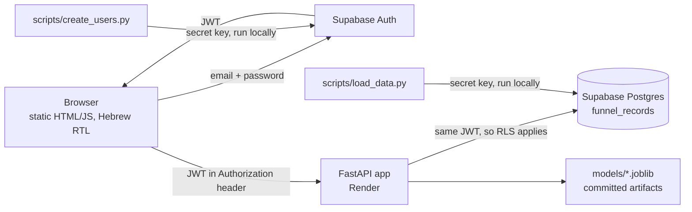

# FunnelIQ

A login-gated marketing-intelligence tool for a fictional agency, Northbound Media. It
answers the founder's five questions from one dataset of 3,500 campaign records:

1. How long will a new customer stay? (predicted lifetime in months)
2. Who is likely to buy more? (upsell probability)
3. Who will become a "super customer"? (a 0–100 score)
4. Where should the ad budget go? (a budget simulator)
5. Are late follow-ups a waste of time? (drop-off per follow-up stage)

**Live app:** <https://funneliq.onrender.com> (sign-in required; demo credentials are not in
this repository).

> **Cold start.** The app runs on Render's free tier, which spins the service down after
> 15 minutes without traffic. The first request after that took **42.77 seconds** in a
> measured test. This is an accepted limitation of the free-tier demo; there is no
> keep-alive. Memory use on the free tier was **not measured** (Render's memory metric is
> not available on that plan), so no memory figure is claimed.

**Findings and recommendations (in Hebrew):** [`REPORT.md`](REPORT.md). Model metrics are
reported there only, not here. The brief this project follows is
[`FunnelIQ_Assignment.html`](FunnelIQ_Assignment.html).

## Architecture

In words: the browser signs the user in with Supabase Auth and receives a token. It sends that
token to the FastAPI app, which reads the data from the Supabase database using the same token
(so row-level security applies) and loads the committed model files to compute predictions. Two
local scripts load the dataset and create the demo users, using a secret key. That key is used
only by those two scripts, run locally: it is never sent to the browser and never set on the
deployed service. The diagram below shows the same flow.

- The browser holds only the **publishable** Supabase key (served by `GET /api/config`).
- The **secret** key is used only by two local scripts and is never deployed.
- API calls carry the signed-in user's own JWT to Supabase, so row-level security is
  enforced on the data the API reads.
- The app's screens are served by seven routes (see
  [`docs/api/openapi.json`](docs/api/openapi.json)): `POST /api/predict/{ltv,upsell,referral,super-customer}`,
  `GET /api/insights/{budget-tiers,followup}`, `GET /api/simulate/budget`.

## Repository layout

| Path | What it is |
|---|---|
| `app/` | FastAPI app, auth, inference, static front end (`app/static/`) |
| `models/` | Trained model artifacts and `metrics.json` (committed; the app loads these) |
| `scripts/` | Data loading, user creation, training, analysis, report builder |
| `schema.sql` | Snapshot of the final database schema, written to be pasted into the Supabase SQL editor (its execution has not been verified; see Known limits) |
| `supabase/` | Migrations (history) and SQL verification layers |
| `docs/` | Findings, feature-availability matrix, API contract, planning, acceptance evidence |
| `tests/`, `e2e/`, `live/` | Unit/contract tests; browser tests; checks against the deployed app |
| `render.yaml` | Render service definition |

## Run it yourself

You need **Python 3.12**, a free **Supabase** project, and **the dataset**.

**The dataset is not distributed.** `funnel_marketing_data.csv` is deliberately kept out of
this repository. Put your copy in the repository root. `scripts/load_data.py` refuses to
load a file whose SHA-256 differs from
`8ac67d50a6f96a8ece8abd770a5a1901b34036a5c98656455eb04cee07d707aa`.

**Run every command below from the repository root**, because the paths in them
(`environment.yml`, `requirements.txt`, `scripts/...`, `app.main:app`) are relative.

1. **Environment.**
   - **Windows:** `conda env create -f environment.yml`, then `conda activate pro1_FunnelIQ`.
     This file is meant for Windows (it pins Windows build strings).
   - **Other systems:** create a Python 3.12 virtual environment and install the pinned
     dependencies: `python3.12 -m venv .venv`, activate it (`source .venv/bin/activate`), then
     `pip install -r requirements.txt`.
2. **Supabase project.** Create a **new, empty** Supabase project, then run the contents of
   [`schema.sql`](schema.sql) in the SQL editor **once**. It creates the table, row-level
   security, grants and views, and is not meant to be re-run on a project that already has them.
3. **Configuration.** Copy `.env.example` to `.env` and fill in `SUPABASE_URL`,
   `SUPABASE_PUBLISHABLE_KEY` and `SUPABASE_SECRET_KEY`. `.env` is git-ignored; never commit it.
4. **Load the data.** `python scripts/load_data.py` (idempotent: it upserts on a source row id).
5. **Create the demo users.** `python scripts/create_users.py`. Passwords are typed at a
   prompt and never stored. The `northbound` user can use the app; the `noorg` user exists
   to demonstrate that a user without an organization is rejected with 403.
6. **Start the app.** `uvicorn app.main:app --reload`, then open <http://localhost:8000>
   and sign in with a demo user.
7. **Tests.** `python -m pytest -q` (CI runs the same command on Python 3.12). Some tests that
   need the CSV skip themselves when it is absent.

The trained models are committed, so you do not need to train anything. `scripts/train.py`
documents how they were produced; the Holdout set was opened exactly once, so retraining is
not part of normal use.

## Deployment

`render.yaml` defines a free-tier Render web service (Frankfurt) that installs
`requirements.txt` and starts `uvicorn app.main:app`. Set `SUPABASE_URL` and
`SUPABASE_PUBLISHABLE_KEY` in the Render dashboard. **Do not** set `SUPABASE_SECRET_KEY` there.
This path is documented from the existing deployment, not re-run for this README.

**Deviation from the brief, on purpose:** the brief names Railway but states that "Render or
Fly.io are drop-in substitutes for this pillar" (§07), so this project uses Render. There is no
demo video and no notebook.

## Known limits

- The demo user credentials are not in the repository.
- **The setup steps have not been run end to end on a clean Supabase project, and `schema.sql` has
  not been executed against a database as part of this documentation work.** The steps were
  reviewed by reading them against the scripts and configuration files.
- The dataset has no data dictionary and no dates, so every finding is descriptive, not causal.
  See the limitations section of [`REPORT.md`](REPORT.md).
- **Project license: none chosen yet.** This repository has no `LICENSE` file. That is separate
  from the third-party notices in Credits below, such as the MIT license of `supabase-js`, which
  covers that library only and says nothing about this project's own code.

## Credits

Versions are the ones pinned in `requirements.txt` or `app/static/index.html`. Licenses of the
Python packages were read from their installed package metadata. The `supabase-js` license is
the text of upstream's `LICENSE` at tag `v2.58.0`, saved in `e2e/vendor/supabase-js.LICENSE`.
Rubik's license was read from its repository.

Note on `supabase.min.js`: the application loads it from jsDelivr (version and integrity hash
pinned in `app/static/index.html`). `e2e/vendor/supabase.min.js` is a vendored copy used only by
the browser tests. That copy carries no license header, only a jsDelivr comment, so the MIT license text and
copyright line of that exact version (2.58.0, Copyright (c) 2020 Supabase) are stored next to
it in [`e2e/vendor/supabase-js.LICENSE`](e2e/vendor/supabase-js.LICENSE). `e2e/vendor/SOURCE.md`
records the source URL, version and hash.

| Component | Version | License | Used for |
|---|---|---|---|
| FastAPI | 0.141.1 | MIT | API |
| Uvicorn | 0.52.4 | BSD-3-Clause | ASGI server |
| Pydantic | 2.13.4 | MIT | Request/response schemas |
| pandas | 3.0.5 | BSD-3-Clause | Data handling |
| NumPy | 2.5.2 | BSD-3-Clause and others (see package) | Numerics |
| scikit-learn | 1.9.0 | BSD-3-Clause | Pipelines, CV, metrics |
| XGBoost | 3.4.1 | Apache-2.0 | Models |
| LightGBM | 4.7.0 | MIT | Models |
| CatBoost | 1.2.10 | Apache-2.0 | Models |
| joblib | 1.5.3 | BSD-3-Clause | Model artifacts |
| Matplotlib | 3.11.1 | Matplotlib license (PSF-based) | Charts |
| seaborn | 0.13.2 | BSD | Charts |
| supabase (Python) | 2.31.0 | MIT | Database and Auth client |
| PyJWT | 2.13.0 | MIT | Token handling |
| python-dotenv | 1.2.3 | BSD-3-Clause | Local configuration |
| `@supabase/supabase-js` (`supabase.min.js`) | 2.58.0 | MIT (third-party; text in `e2e/vendor/supabase-js.LICENSE`) | Browser sign-in, loaded from jsDelivr with SRI |
| Rubik font (Google Fonts) | — | SIL Open Font License 1.1 | Typography |
| pytest, httpx | 9.1.1, 0.28.1 | MIT, BSD-3-Clause | Tests |
| Playwright (+ pytest-playwright) | 1.63.0 (0.9.0) | not checked | Local browser tests (`requirements-e2e.txt`) |
| Stitch | — | not checked | Reference screen designs in `docs/design/` |

## How it was built

This project was built with AI assistance: **Claude Code** wrote and edited code, tests and
documentation, and **Codex** acted as an independent second reviewer of plans and changes. The
author set the requirements, made the decisions, and approved every phase. Every non-trivial
design decision is numbered (`D#`) in [`docs/planning/`](docs/planning/), and the review
exchanges are in `docs/planning/codex-review.md` and `docs/planning/codex-history.md`.
