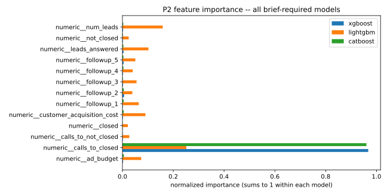
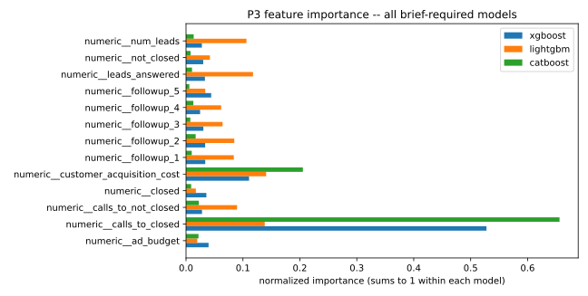
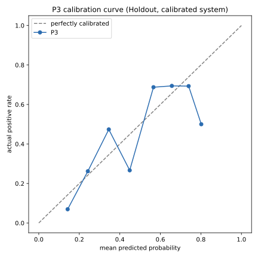
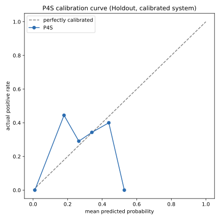
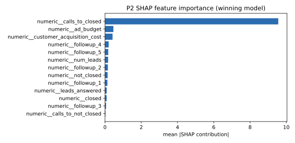

# FunnelIQ — דוח ממצאים והמלצות

דוח זה מסכם את העבודה האנליטית של FunnelIQ עבור Northbound Media. **כל מספר שנמדד**
(שיעורים, מדדי מודל, גדלי מדגם, רווחים) נגזר אוטומטית מקבצי התוצאות שב-repo
(`models/metrics.json`, `docs/findings.json` ועוד) דרך מניפסט, ו-`scripts/build_report.py`
מייצר את הדוח מתבנית. מספרים שאינם מדידה כתובים בטקסט: גדלי הקמפיינים והתקציב
שהבריף מגדיר, ספי הכללים והסיווג (`0.5`, `34`, 95%) ומספרי הסעיפים. מקור הנתונים:
`funnel_marketing_data.csv` (3,500 שורות, אינו מופץ ב-repo).

⚠ **כל המסקנות כאן הן תיאוריות, לא סיבתיות.** הנתונים אינם ניסוי.

## התשובות בקצרה

1. **כמה זמן לקוח חדש יישאר?** אפשר להעריך זאת היטב: הטעות הטיפוסית היא כ-2.70
   חודשים (על נתונים שהמודל לא ראה). הגורם החזק ביותר הוא מספר השיחות עד סגירה, הקשר
   שלילי וחזק מאוד: ככל שנדרשו פחות שיחות לסגירה, הלקוח נשאר זמן רב יותר. ראו §2.
2. **מי צפוי לקנות עוד?** המודל צודק ב-76.15% מהמקרים, לעומת
   53.71% בניחוש "אף אחד". כלל פשוט ("משך חיים ארוך ועלות רכישה נמוכה") מפספס רוב
   הלקוחות הרלוונטיים. ראו §3.
3. **מי יהפוך ללקוח-על?** הציון 0–100 קיים, אך **חלש מאוד** בתוך קבוצת התקציב שבה
   נמצאים כל לקוחות-העל בנתונים שנבדקו (האימון וה-Holdout). הוא מתאים לבדיקה ידנית בלבד, לא לסינון אוטומטי. ראו §4.
4. **לאן להפנות את תקציב הפרסום?** אין הכרעה: הסימולטור והבדיקה לאחור אינם מכריעים.
   ההמלצה: ניסוי מבוקר בקמפיינים של ₪2,000–₪5,000 לפני כל שינוי גדול. ראו §6.
5. **האם מעקבים מאוחרים הם בזבוז זמן?** אין בסיס לעצירה אוטומטית אחרי
   המעקב השלישי: הנשירה אחרי המעקב הרביעי היא הנמוכה בשרשרת (10.4%). המסקנה
   זהירה, כי הקובץ אינו מונה מעקבים לעסקה בודדת. ראו §5.

## 1. הנתונים והניקוי

- **33 מתוך 3,500 שורות אינן שלמות:** ב-4 חסר `ltv_months`
  וב-29 חסר `cumulative_profit`. אף שורה לא נמחקה במקור. באימון מוסרות
  רק שורות שהיעד שלהן חסר, לכל משימה בנפרד (P6: 29 שורות;
  P2: 0). בפיצ'רים אין חסרים, ולכן לא נעשה imputation.
- **כפילויות:** 19 שורות ב-9 קבוצות זהות. הן נשארו, והרגישות שלהן
  נבדקה ב-`docs/findings.json` (ההשפעה זניחה).
- **335 שורות עם רווח מצטבר 0**, כולן של לקוחות שלא רכשו.

### קורלציה מול הרווח המצטבר

הקשר החזק ביותר הוא עם משך החיים (`ltv_months`, r=0.85) ועם upsell
(r=0.65); ככל שמספר השיחות עד סגירה גבוה יותר הרווח נמוך
(r=-0.55).

### תקציב ומספר לידים

**יותר תקציב אינו קונה לידים באופן פרופורציונלי.** מספר הלידים לכל ₪1,000 יורד מ-
26.0 ל-6.1: תקציב גדול פי 40
מניב חציון לידים גדול פי 9.4 בלבד. זה תיאור של הקובץ, לא טענה על רווח.

### שיעור המרה לפי טייר

**הטייר Mid ממיר הכי טוב** (8.2%), לפני High (5.4%) ו-Low
(4.5%), הפרש של 2.8 נקודות אחוז. **זה מפתיע** ביחס לציפייה שתקציב
גדול ימיר טוב יותר. הרווח הממוצע לרשומה מתיישר עם זה: ₪21,792 ב-Mid לעומת
₪5,186 ב-High ו-₪2,291 ב-Low.

## 2. משך חיי לקוח (P2)

- **שלושה מודלים, 5-fold CV:** CatBoost (RMSE 2.80, R² 0.945), XGBoost
  (2.81, 0.945), LightGBM (2.82, 0.944). לשם השוואה:
  רגרסיה לינארית 3.52 וניחוש הממוצע 12.06. **ההבדלים בין שלושת
  המודלים זניחים**; נבחר CatBoost.
- **על ה-Holdout** (633 שורות שלא נגעו בהן באימון): RMSE 2.70, R²
  0.948. טווח ביטחון של 95% (conformal) בגודל ±5.1 חודשים כיסה
  בפועל 92.9% מהמקרים, כלומר מעט פחות מהיעד.
- **האם `cumulative_profit` הוא פיצ'ר?** לא. הוא תוצאה מצטברת שמתגבשת אחרי משך החיים,
  ולכן אינו זמין בעת החיזוי, והכללתו הייתה דליפה (§8).

### חשיבות הפיצ'רים

**שלושת המודלים מסכימים:** `calls_to_closed` הוא הפיצ'ר הראשון בכולם
(96% מהחשיבות ב-CatBoost, 97% ב-XGBoost).
סולמות החשיבות שונים בין מודלים, ולכן משווים דירוג ולא ערכים.

**הרמה החזקה ביותר, בשני משפטים:** מספר השיחות עד סגירה; פחות שיחות מלוות משך חיים
ארוך יותר. כדאי לבחון בניסוי, כי הקשר אינו סיבתי, אם קיצור מחזור המכירה מאריך את משך החיים.

## 3. הסתברות ל-Upsell (P3)

- **איזון:** ב-633 שורות ה-Holdout 46.3% עשו upsell, איזון סביר. משקלות מחלקה
  (יחס 1.16) לא שיפרו באופן עקבי: XGBoost 0.794 →
  0.793 ב-AUC, CatBoost 0.796 → 0.797,
  LightGBM 0.791 → 0.791. **לא הופעלו.**
- **בחירה:** XGBoost, 5-fold stratified CV (ROC-AUC 0.794; CatBoost
  0.796, LightGBM 0.791, לוגיסטית 0.778).
- **האם Accuracy מספיק? לא.** שלושה שיעורי רוב שונים, כל אחד על אוכלוסייה אחרת:
  53.65% על כל 3,163 הרוכשים, 53.66% בניחוש
  הרוב שנבדק ב-CV על 2,024 שורות האימון, ו-53.71% על
  633 שורות ה-Holdout. המודל מגיע ל-76.15% שם, תוספת של
  22.43 נקודות אחוז.
- **Holdout:** Precision 69.2%, Recall 87.4%, F1
  77.2%, ROC-AUC 0.789. מדדי ה-CV בטבלה שלהלן.

### חשיבות הפיצ'רים

**שילוב של פיצ'רים, לא אחד:** `calls_to_closed` מוביל (53% ב-XGBoost)
ואחריו עלות הרכישה (11%). ב-LightGBM שני אלה כמעט שווים.

### כלל עסקי מול המודל
| כלל | Accuracy | Precision | Recall |
|---|---|---|---|
| LTV גדול מ-23 ו-CAC קטן מ-1,000 (כלל הבריף, בדיעבד) | 61.4% | 72.3% | 27.1% |
| שיחות שנסגרו מעל 3 ו-CAC קטן מ-1,000 (בר-הפעלה) | 56.7% | 68.0% | 12.5% |
| המודל (XGBoost, CV) | 75.7% | 70.3% | 82.6% |

**איפה הכלל מנצח ואיפה מפסיד:** הכלל מדויק כשהוא מסמן (Precision דומה למודל או גבוה
ממנו), אך מפספס רוב הלקוחות הרלוונטיים (Recall נמוך מאוד). המודל מוצא את רובם.
כלל הבריף נשען על LTV שאינו ידוע בזמן החיזוי, ולכן הוא משמש להשוואה בלבד.

### כיול

## 4. ציון לקוח-על (P4 ו-P4S)

- **המודל P4 (נטייה להפניה):** נבחר מודל **לוגיסטי** על פני CatBoost לפי כלל One-SE ופשטות:
  ROC-AUC ב-CV 0.785 מול 0.790, הפרש בתוך שגיאת התקן. על
  ה-Holdout: ROC-AUC 0.799, Accuracy 76.3% (רוב: 57.3%).
  ניתוח רגישות על אוכלוסייה רחבה יותר (2,867 שורות) נותן 0.785; הוא
  למחקר בלבד, ו-633 שורות ה-Holdout לא היו חלק מהאימון.
- **המודל P4S (הציון 0–100):** לקוח-על = הופנה **וגם** עשה upsell **וגם** LTV ≥ 34. מודל
  CatBoost ייעודי, כפי שהבריף דורש; לפי ה-CV הלוגיסטי היה מעט עדיף (0.792
  מול 0.784), והבחירה ב-CatBoost היא עמידה מכוונת בדרישת הבריף.

### כיול הציון

⚠ העקומה אינה מציגה את גודל כל bin, ושלוש הנקודות האחרונות מבוססות על מעט מאוד שורות,
ולכן הן רעש.

- **המגבלה המרכזית:** ב-Holdout (633 שורות) ה-Accuracy הוא
  83.1%, כמעט בדיוק כמו ניחוש "אף אחד אינו לקוח-על" (83.3%),
  וה-Recall בסף 0.5 הוא 0%. ה-ROC-AUC הכללי (0.801)
  כנראה נובע בעיקר מההפרדה בין טיירים: ב-Low (116 שורות) וב-High (189) אין
  אף לקוח-על, ובתוך Mid (328 שורות, 32.3% לקוחות-על) ה-AUC הוא
  0.528, כמעט אקראי.

### פרופיל לקוחות-העל
**529 לקוחות (16.7% מהרוכשים) מייצרים
33.6% מכלל הרווח.** עלות הרכישה הממוצעת שלהם ₪991
לעומת ₪1,437 בכלל הרוכשים, נמוכה ב-31.1%.

### איך מזהים אותם מוקדם יותר? (תשובה בגבולות הראיה)
1. **בדיעבד (A2):** בקבוצת האימון (2,024 רוכשים) **כל** 338 לקוחות-העל
   נמצאים ב-Mid: 338 מתוך 1,041 (32.5%), ואפס מתוך
   362 ב-Low ומתוך 621 ב-High.
2. **הציון הוא אות לבדיקה ידנית בלבד:** רוכש ידוע, מעקב 1, חלון סגור. אין לסנן לפיו
   אוטומטית, ואין להמליץ על סינון לפי טייר.
3. **מוקדם יותר באמת:** מודל הפניה שנבנה רק על נתוני המשפך המוקדמים משיג ROC-AUC
   0.701 בלבד (מחקר, לא מוצר). כדי לזהות מוקדם צריך לאסוף **אותות מוקדמים
   נוספים** שאינם בקובץ.

## 5. פרדוקס המעקבים

### נשירה בכל שלב

מעקב 1: 21.7% · מעקב 2: 25.7% · מעקב 3: 18.6% ·
מעקב 4: 10.4% · מעקב 5: 29.2%.

**החריגה:** הנשירה אינה עולה בהדרגה: אחרי המעקב הרביעי היא הנמוכה בשרשרת, ואחרי
החמישי הגבוהה ביותר.

### שיחות עד סגירה

מתוך 3,318 רשומות עם סגירה: חציון 3, שכיח 2, ממוצע
3.71; ב-1,595 מהן (48.07%) הממוצע הוא 4 שיחות ומעלה. **זה ממוצע
ברמת רשומה**, ואי אפשר לקרוא ממנו כמה מעקבים נדרשה עסקה בודדת.

**המלצה: לא לאמץ עצירה אוטומטית אחרי המעקב השלישי.** להמשיך מעבר לשלישי באופן מבוקר,
ולמדוד בכל שלב שיעור סגירה שולי, זמן עבודה ועלות לפני שינוי קבוע.

## 6. אופטימיזציית תקציב

- **המודל:** רגרסיה לינארית נבחרה לפי One-SE (CV: RMSE 6,357, R²
  0.690; מודל עצים: 5,366, 0.773). על ה-Holdout
  (695 שורות): RMSE 4,591, R² 0.796. ההטיה הממוצעת בעשירון
  העליון היא ₪-5,329 לרשומה (שלילית = חיזוי נמוך מדי).
- **הסימולטור** מכיר רק את התקציב של כל קמפיין ומשלים את שאר הפיצ'רים בפרופיל טיפוסי
  לרמת תקציב. כל אסטרטגיה היא ₪50,000.

| אסטרטגיה | רווח צפוי כולל | טווח (bootstrap) |
|---|---|---|
| 100 × ₪500 | 789,594 | 379,299–856,634 |
| 25 × ₪2,000 | 530,953 | 519,335–549,756 |
| 10 × ₪5,000 | 227,214 | 177,031–261,079 |
| 2 × ₪20,000 + ₪10,000 | 7,642 | 477–13,981 |

הרווח בטבלה הוא רווח **מצטבר חזוי** (`cumulative_profit`) לכל הקמפיינים יחד, לא רווח חודשי ולא רווח נטו מהתקציב.

**ריכוז או פיזור?** אין הכרעה. הסימולטור מדרג את 100 × ₪500 ראשונה ואת האסטרטגיה
הגדולה אחרונה, אך הטווח של 100 × ₪500 רחב וחופף ל-25 × ₪2,000, וה-backtest חלש בדיוק
בקצוות, ולכן גם הדירוג של הקצוות אינו מוכח.

⚠ **ה-backtest מגביל את שני הקצוות.** ב-₪500 המודל חזה ₪7,896 לרשומה והתקבל
בפועל ₪919 (17 רשומות ב-Holdout). ב-₪2,000 החיזוי קרוב:
₪21,238 מול ₪20,651 (85 רשומות). ב-₪20,000 המודל חזה
₪797 והתקבל ₪4,470 (14 רשומות).

**מה לומר למייסדת לחודש הבא:** לא לשנות את ההקצאה כולה על סמך הסימולטור. להקצות חלק
מהתקציב לניסוי מבוקר בקמפיינים של ₪2,000–₪5,000 ולמדוד: ב-₪2,000 החיזוי קרוב לבפועל,
ו-Mid הוא הטייר עם שיעור ההמרה והרווח הממוצע הגבוהים בקובץ (§1).

## 7. בחירת מודל

- **הכלל:** מבין המועמדים הזכאים נבחר הפשוט ביותר שבתוך שגיאת תקן אחת מהמוביל (One-SE).
  הכוונון נעשה על אותם folds, ולכן ההשוואה הבלתי-מוטה היא על ה-Holdout.
- **זוכים:** P2 CatBoost · P3 XGBoost · P4 לוגיסטי · P4S CatBoost (עמידה מכוונת בבריף) ·
  P6 לינארי. בכל משימה נבדק גם Dummy. המודלים שנבחרו עולים עליו (חוץ מ-Accuracy של P4S, ראו §4);
  Huber ב-P6 לא עלה עליו ונפסל.
- **מגבלה:** pseudo-Huber שנבדק ב-P6 אינו Huber קלאסי; הוא הוצא מהמועמדים.
- הפירוט וסיבת כל פסילה: `docs/planning/SPEC.md` ו-`models/metrics.json`.

## 8. דליפה וזמינות פיצ'רים

כל עמודה סווגה לפי המשמעות שלה ולפי **מתי הערך זמין** בכל משימה, ולא לפי קשר נמדד ליעד.
`app/features.py` הוא המקור המכני; `tests/test_features.py` בודק התאמה מלאה לטבלה.

| # | עמודה (מקור) | גרעיניות | משמעות עסקית | זמינות בזמן החיזוי | P2 | P3 | P4 | P6 | P4S | הערה — סיבת ההכללה/ההחרגה |
|---|---|---|---|---|---|---|---|---|---|---|
| 1 | `ad_budget` | קמפיין | הוצאת הפרסום החודשית של הרשומה (₪) | P6: ידוע בהקצאה. P2/P3/P4: סופי בסוף המחזור. P4S: ערך חודשי סופי לחלון סגור | Feature | Feature | Feature | Feature | Feature | **היחיד** הזמין ישירות ב-snapshot של P6 (`SPEC.md` § נקודות חיזוי: "`ad_budget` בלבד"). ב-P4S זמינותו היא תנאי שימוש, לא עובדה מתוארכת |
| 2 | `num_leads` | קמפיין | מספר הלידים שנוצרו מהקמפיין | P2/P3/P4: בתום המשפך, ישירות. P4S: סך סופי של חלון גיוס סגור. P6 (אימון): רשומות היסטוריות, פיצ'ר אמיתי; **בזמן החיזוי הערך מוחלף כחלק מפרופיל רב־משתני תקף שנצפה באותו תקציב ב־train** | Feature | Feature | Feature | Derived | Feature | שלישיית קולינאריות עם `leads_answered`/`leads_not_answered` — שתיים בלבד נכנסות בפועל למודל, **בתוך ה-Pipeline** (פאזה 6), לא כאן. ב-P6: `Derived` כי אינו `ad_budget`. ב-P4S: תנאי הפעלה, לא זמינות שהוכחה בתאריך |
| 3 | `leads_answered` | קמפיין | מספר הלידים שהשיבו לפנייה הראשונית | כמו `num_leads`; ב־P4S לאחר השלמת ניסיון המענה לקבוצה הסגורה | Feature | Feature | Feature | Derived | Feature | קולינאריות (כנ"ל); `Derived` ב-P6 (אינו `ad_budget`). ב-P4S הזמינות מותנית בחוזה ההפעלה |
| 4 | `leads_not_answered` | קמפיין | מספר הלידים שלא השיבו | כמו `num_leads` | Feature | Feature | Feature | Derived | Excluded | `= num_leads − leads_answered` בדיוק — **קולינאריות מושלמת**, לא רק קורלציה; `Derived` ב-P6 (אינו `ad_budget`). **ב-P4S: `Excluded` — לא דליפה, אלא נגזרת קולינארית מיותרת: כבר נגזר במלואו מ-`num_leads`/`leads_answered` שכן שניהם `Feature`** |
| 5 | `followup_1` | קמפיין | לידים שנותרו פעילים אחרי מעקב 1 (שלב 1 במשפך היורד) | P2/P3/P4: בתום מחזור, ישירות. P6: מוחלף בפרופיל בזמן החיזוי. P4S: לאחר מעקב 1 לקבוצה חודשית סגורה | Feature | Feature | Feature | Derived | Feature | `Derived` ב-P6 — אינו `ad_budget`. ב-P4S זה הפיצ'ר המאוחר ביותר; רכישה ידועה היא תנאי הפעלה נוסף |
| 6 | `followup_2` | קמפיין | לידים פעילים אחרי מעקב 2 | כנ"ל | Feature | Feature | Feature | Derived | Excluded | כנ"ל. **ב-P4S: `Excluded` — מחוץ לחוזה שאחרי מעקב 1** |
| 7 | `followup_3` | קמפיין | לידים פעילים אחרי מעקב 3 | כנ"ל | Feature | Feature | Feature | Derived | Excluded | כנ"ל. ב-P4S: מחוץ ל-snapshot (כנ"ל) |
| 8 | `followup_4` | קמפיין | לידים פעילים אחרי מעקב 4 | כנ"ל | Feature | Feature | Feature | Derived | Excluded | כנ"ל. ב-P4S: מחוץ ל-snapshot (כנ"ל) |
| 9 | `followup_5` | קמפיין | לידים פעילים אחרי מעקב 5 (סוף המשפך) | כנ"ל | Feature | Feature | Feature | Derived | Excluded | כנ"ל. ב-P4S: מחוץ ל-snapshot (כנ"ל) |
| 10 | `not_closed` | קמפיין | לידים שלא נסגרו לעסקה עד תום המעקבים | אינו ידוע ברגע רכישת לקוח בודד; ידוע בתום מחזור הקמפיין | Feature | Feature | Feature | Derived | Excluded | `Derived` ב-P6 — אינו `ad_budget`. **ב-P4S: `Excluded` — תוצאת סוף משפך, אחרי חוזה מעקב 1** |
| 11 | `closed` | קמפיין | מספר העסקאות שנסגרו בקמפיין | בתום מחזור הקמפיין | Feature | Feature | Feature | Derived | Excluded | כנ"ל. ב-P4S: `Excluded` (כנ"ל) |
| 12 | `calls_to_closed` | קמפיין | ממוצע שיחות עד סגירה (ברמת רשומה — לא היסטוריה פר-עסקה, ר' `PHASE0.md`) | בתום מחזור הקמפיין | Feature | Feature | Feature | Derived | Excluded | כנ"ל. ב-P4S: `Excluded` (כנ"ל) |
| 13 | `calls_to_not_closed` | קמפיין | ממוצע שיחות ללידים שלא נסגרו | כמו `not_closed` — לא ידוע ברגע הרכישה, ידוע בתום מחזור | Feature | Feature | Feature | Derived | Excluded | כנ"ל. ב-P4S: `Excluded` (כנ"ל) |
| 14 | `customer_acquisition_cost` | קמפיין | עלות רכישת לקוח ממוצעת בקמפיין (₪) | ידוע לאחר שהתקציב ומספר הסגירות סופיים | Feature | Feature | Feature | Derived | Excluded | בקובץ כולו: `floor(ad_budget/closed)` כש־`closed>0`, אחרת 0. זו נגזרת נתונים; סטטוס `Derived` כאן עדיין מתייחס להחלפת פרופיל P6. ב-P4S: `Excluded` |
| 15 | `ltv_months` | לקוח | אורך חיי הלקוח (חודשים) | תוצאה כוללת; מועד המימוש אינו מתוארך בקובץ | **Target** | Excluded | Excluded | Excluded | Excluded | P2 היעד. ב-P3/P4 הוא מוחרג כתוצאה מאוחרת לפי חוזה השימוש, ללא הוכחת תאריך. P6 מכיר רק תקציב. **P4S: רכיב בתווית המשולבת** `referred=Yes AND upsell=1 AND ltv_months>=34` — `Excluded`, לעולם לא `Feature` |
| 16 | `purchased` | לקוח | האם הליד הפך ללקוח משלם (0/1) | קבוע ב-`purchased=1`, משתנה בכלל 3,500 השורות. **ב-P6: לא ידוע ברגע הקצאת התקציב** — עדיין לא ידוע אם תתרחש רכישה כלשהי | Excluded | Excluded | Excluded | **Derived** | Excluded | P2/P3/P4: **קבוע באוכלוסייה** (`nunique=1`) — לא דליפה במובן הרגיל, פשוט אינו פיצ'ר מבחין. P6: משתנה באוכלוסייה המלאה ואינו ברשימת הדליפה, **אך אינו `Feature` ישיר** — מבחן הזמינות של P6 הוא "`ad_budget` בלבד". ב־CP9 הוחלף כחלק מאותו פרופיל רב־משתני נצפה, כמו יתר מועמדי P6. **P4S: קבוע באוכלוסייה, והרכישה הידועה היא תנאי הפעלה** |
| 17 | `upsell` | לקוח | האם הלקוח רכש שירות נוסף (0/1) | לאחר רכישה ראשונית; מועד המימוש אינו מתוארך בקובץ | Excluded | **Target** | Excluded | Excluded | Excluded | P3 היעד. ב-P2/P4 הוא מוחרג כתוצאה מאוחרת לפי חוזה השימוש. P6: ברשימת הדליפה. **P4S: רכיב בתווית המשולבת** — `Excluded`, לעולם לא `Feature` |
| 18 | `cumulative_profit` | לקוח | סך הרווח המצטבר מהלקוח (₪) | תוצאה מצטברת; אופק הזמן אינו מוגדר | Excluded | Excluded | Excluded | **Target** | Excluded | P6 היעד. ב-P2/P3/P4/P4S הוא מוחרג כתוצאה מאוחרת. בסימולטור אין לפרשו כרווח חודשי או נטו מהתקציב |
| 19 | `referred` | לקוח | האם הלקוח הפנה אדם נוסף (Yes/No) | לאחר רכישה; מועד המימוש אינו מתוארך בקובץ | Excluded | Excluded | **Target** | Excluded | Excluded | P4 היעד. ב-P2/P3 הוא מוחרג כתוצאה מאוחרת לפי חוזה השימוש. P6: ברשימת הדליפה. **P4S: רכיב בתווית המשולבת**, אך `TARGET["P4S"]` הוא המזהה הלוגי `super_customer`, לא `referred` עצמו |

| משימה | `n` מועמדים (`Feature`+`Derived`, לפני צמצום קולינאריות) | פירוט |
|---|---|---|
| P2 | 14 | 14 `Feature` · 0 `Derived` |
| P3 | 14 | 14 `Feature` · 0 `Derived` |
| P4 | 14 | 14 `Feature` · 0 `Derived` |
| P6 | 15 | **1** `Feature` (`ad_budget` בלבד) · **14** `Derived` |
| **P4S** | **4** | **4** `Feature` (`ad_budget`, `num_leads`, `leads_answered`, `followup_1`) · **0** `Derived` · **15** `Excluded` |

## 9. אי-ודאות והסברים

- **כיול:** כל הסתברויות P3/P4/P4S מכוילות בשיטת sigmoid.
- **SHAP** למודל הזוכה של P2:

### תרשים SHAP

הסברים מקומיים לדוגמה: `docs/shap_local_*.svg`.

## 10. מגבלות

- **הכול תיאורי**, ללא טענה סיבתית. מגבלות P4S ו-P6 ב-§4 וב-§6.
- **גרעיניות מעורבת:** חלק מהעמודות ברמת קמפיין וחלק ברמת לקוח, ואין מילון נתונים.
- **אין תאריכים בקובץ**, ולכן אי אפשר להוכיח את סדר האירועים.
- **גודל מדגם קטן** ב-Holdout בקצוות התקציב (₪500 ו-₪20,000).

## 11. צ'קליסט ראיות

פריסה חיה, restart, RLS בשלושה מצבי משתמש וקבלה ממחשב אחר מתועדים ב-
`docs/acceptance/`. מדדי המודלים ב-`models/metrics.json`, עקומות הכיול והסברי SHAP
ב-`docs/`, ותרשים הארכיטקטורה ב-`README.md`.
