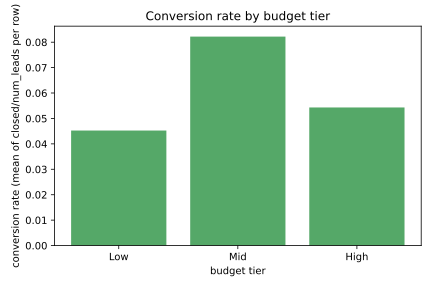
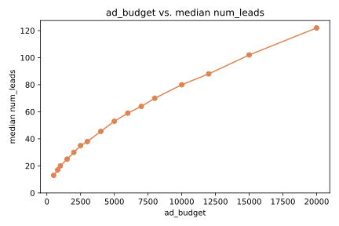
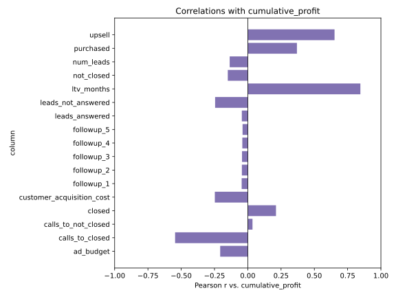
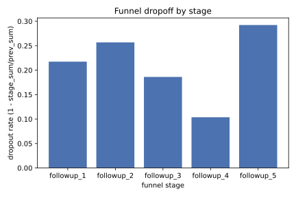
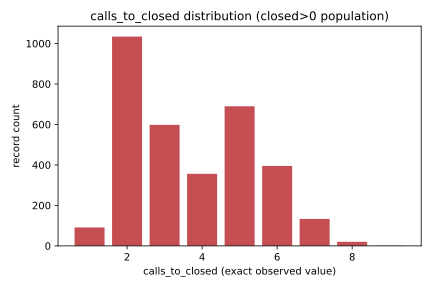

# FINDINGS.md — ניקוי + EDA (פאזה 5)

מסמך זה מרונדר אוטומטית מתוך `results` (ר' `docs/findings.json`) ע"י
`scripts/analysis.py`'s `render_findings_md` -- כל ערך אנליטי כאן הוא
`$placeholder` שנפתר מפלט פונקציית חישוב טהורה ובדוקה (PHASE5.md D6).
מקור הנתונים: `funnel_marketing_data.csv`, `source_sha256=8ac67d50a6f96a8ece8abd770a5a1901b34036a5c98656455eb04cee07d707aa`.

⚠ **כל הממצאים במסמך זה הם `dataset description` בלבד** (SPEC.md §
גרעיניות מעורבת's "מוסק בלבד" framing, PHASE5.md D3): שום ממצא כאן אינו
טענה סיבתית, ואף אחד מהם אינו משמש לבחירת פיצ'רים, ספים או מודל בפאזה 6.

## סקירת הקובץ (אוכלוסייה: 3,500, dataset description)

- שורות בקובץ: **3,500**.
- חסרים: `ltv_months` -- 4, `cumulative_profit` -- 29,
  לפחות אחד מהשניים -- 33.
- כפילויות: 19 שורות ב-9 קבוצות (זהות בכל 19 העמודות הגולמיות).

## חבילה 1 — טייר תקציב, כפילויות, קורלציות (אוכלוסייה: 3,500, dataset description)

שיעור ההמרה הממוצע לפי טייר תקציב (ממוצע `closed/num_leads` לשורה):

| טייר | n | שיעור המרה |
|---|---|---|
| Low | 780 | 4.5% |
| Mid | 1,717 | 8.2% |
| High | 1,003 | 5.4% |
| gap (1501-1999) | 0 | לא מוגדר -- אין ערך `conversion_rate` |

תרשים עמודות: שיעור ההמרה הממוצע (closed/num_leads לשורה) בכל אחד משלושת טייירי התקציב Low/Mid/High. הטייר 'gap' (טווח ad_budget 1501-1999, 0 רשומות בקובץ) אינו כלול בתרשים -- אין לו conversion_rate מוגדר ב-results, רק ספירת רשומות. טייר עם conversion_rate=None (למשל אפס רשומות באוכלוסייה) מסומן N/A במפורש ולא מצויר כעמודת אפס. כל הערכים לקוחים ישירות מ-results['budget_tiers'], בלי חישוב חוזר מה-CSV.

עקומת `ad_budget` → חציון `num_leads`, על 16 ערכי `ad_budget`
בדידים:

תרשים קו: החציון של num_leads עבור כל אחד מ-16 ערכי ad_budget הבדידים בקובץ, מסודר בסדר עולה לפי ad_budget. כל נקודה לקוחה ישירות מ-results['ad_budget_leads_curve'], בלי חישוב חוזר מה-CSV. תיאור דטהסט בלבד -- אין כאן מסקנה על יעילות תקציב.

קורלציית פירסון (r) מול `cumulative_profit`, לכל 17 העמודות
המספריות הגולמיות האחרות (למשל `ltv_months`: 0.85, `upsell`: 0.65):

תרשים עמודות אופקי: מקדם המתאם של פירסון (r) בין כל אחת מ-17 העמודות המספריות הגולמיות (למעט cumulative_profit עצמו) לבין cumulative_profit, ממוין בסדר אלפביתי לפי שם עמודה. עמודה עם שונות אפס או פחות משני זוגות תקפים (None ב-results, לא NaN) מסומנת N/A במפורש ואינה מצוירת -- אינה שקולה ל-r=0, שהוא ערך אמיתי (העדר קשר קווי נמדד). כל הערכים לקוחים ישירות מ-results['correlations'], בלי חישוב חוזר מה-CSV. תיאור דטהסט בלבד -- לא בסיס לבחירת פיצ'רים (D3).

## חבילה 5 — נשירה במשפך, calls_to_closed (אוכלוסייה: 3,500 / 3,163, dataset description)

נשירה בכל שלב במשפך (Σ/Σ, לא ממוצע יחסים לשורה), על 3,500 הרשומות:

תרשים עמודות: שיעור הנשירה בכל שלב במשפך השיווקי, מ-leads_answered ועד followup_5. כל עמודה מחושבת כ-1 פחות סכום השלב חלקי סכום השלב הקודם (Σ/Σ), לא כממוצע יחסים לשורה. שלב ללא ערך מוגדר (למשל כשסכום השלב הקודם הוא אפס) מסומן N/A במפורש ולא מצויר כעמודת אפס. כל הערכים לקוחים ישירות מ-results['funnel_dropoff'], בלי חישוב חוזר מה-CSV. סטטוס: תיאור דטהסט (dataset description) בלבד, לפי D3 -- לא נמצא בו קשר סיבתי.

שלב 1: 21.7% · שלב 2: 25.7% · שלב 3: 18.6% ·
שלב 4: 10.4% · שלב 5: 29.2%.

התפלגות `calls_to_closed` בתוך אוכלוסיית `purchased=1` (3,163 רשומות):

תרשים עמודות: התפלגות calls_to_closed בפועל בתוך אוכלוסיית purchased=1 -- לכל ערך calls_to_closed שנצפה בקובץ (ציר x), ספירת הרשומות עם אותו ערך בדיוק (ציר y), בלי חלוקה ל-bins מומצאים. סך התדירויות שווה n_purchased1=3163. calls_to_closed מתועד ב-SPEC.md כממוצע ברמת רשומה, לא כהיסטוריית שיחות לעסקה בודדת. כל הערכים לקוחים ישירות מ-results['calls_to_closed']['frequency_by_calls_to_closed'], בלי חישוב חוזר מה-CSV.

מתוך 3,163 רשומות `purchased=1`, ב-1,519 מהן (48%) `calls_to_closed`
הממוצע הוא 4 ומעלה. בתת-האוכלוסייה `closed=1` (488 רשומות),
439 מהן (89.96%) מציגות `calls_to_closed >= 4`.

## M1 — ספירת אפסים ב-cumulative_profit (אוכלוסייה: 3,500, dataset description)

335 שורות עם `cumulative_profit == 0`, בנפרד מ-29
השורות החסרות ומ-0 שורות שליליות. הקובץ מייצג אפס במפורש
כ-0, ולכן הוא נספר בנפרד מ-`NaN` -- משמעותו העסקית אינה מוכרעת ללא מילון
נתונים.

## M2 — עקביות האפסים, לא לגיטימיות (אוכלוסייה: 3,500, dataset description)

⚠ אין כאן טענת לגיטימיות: אין מילון נתונים שמוכיח אם `0` הוא רווח אפס אמיתי
או קידוד למשהו חסר (SPEC.md § גרעיניות מעורבת). ראיות עקביות בלבד:

שיעור האפסים בכל חתך (P(profit=0|slice), המכנה גלוי):

| חתך | שיעור אפסים |
|---|---|
| purchased=0 | 99.4% |
| purchased=1 | 0.0% |
| closed=0 | 99.5% |
| closed>0 | 4.6% |

ממוצע `ltv_months`: קבוצת אפס 13.2, קבוצת ידוע-לא-אפס
22.9. ממוצע CAC: קבוצת אפס 729, קבוצת
ידוע-לא-אפס 1,438.

## M3 — עשירון עליון (אוכלוסייה: 3,471, dataset description)

אוכלוסייה: 3,471 הרשומות שבהן `cumulative_profit` ידוע
(29 המוחרגות מדווחות לצידו, לא מוטמעות ולא מסוננות). `K=348`
(10.0%), ערך גבול 27,018, עם 2
רשומות עליו בדיוק. חלק העשירון מסך הרווח: 24.2%
(exact-K, 348 רשומות) לעומת 24.3% (inclusive-ties,
349 רשומות).

## M4 — רווח לפי טייר (אוכלוסייה: 3,500, dataset description)

| טייר | n | חסרים | סכום | ממוצע |
|---|---|---|---|---|
| Low | 780 | 5 | 1,775,180 | 2,291 |
| Mid | 1,717 | 15 | 37,089,864 | 21,792 |
| High | 1,003 | 9 | 5,154,619 | 5,186 |
| gap | 0 | 0 | לא זמין | לא זמין |

## M5 — ספירת outliers (אוכלוסייה: 3,500, dataset description)

שתי שיטות בנפרד, לעולם לא מאוחדות: `1.5×IQR` -- 321 רשומות
ייחודיות מסומנות; `p1/p99` -- 218 רשומות ייחודיות מסומנות.
חפיפה בין שתי השיטות: 89 רשומות. סימון תיאורי בלבד -- אינו
גורר מחיקה או Winsorization; הספים אינם עוברים לפאזה 6.

## M6 — פרופיל הכפילויות (אוכלוסייה: 3,500, dataset description)

זהה במדויק לנתוני חבילה 1 לעיל (19 שורות ב-9 קבוצות)
-- `m6_duplicate_profile()` הוא alias ל-`duplicates()`, לא הגדרה מתחרה.

## מסקנת P5 — תיאורית, לא סיבתית (אוכלוסייה: 3,500 / 3,163, dataset description)

הניסוח הבא זהה מילולית לניסוח הנעול ב-SPEC.md § מסקנת P5:

> הנתונים **אינם תומכים** בעצירה אוטומטית אחרי המעקב השלישי. שיעור הנשירה בשלב
> הרביעי הוא הנמוך בשרשרת (10.4%). בנוסף, ב-1,519 מתוך 3,163 רשומות שבהן
> `purchased = 1` (48%) הערך **הממוצע** של `calls_to_closed` הוא 4 ומעלה,
> ובתת-האוכלוסייה `closed = 1` — 439 מתוך 488 רשומות (89.96%) מציגות
> `calls_to_closed >= 4`.
> **מה שהנתונים אינם מוכיחים:** `calls_to_closed` הוא ממוצע ברמת רשומה ולא
> היסטוריה פר-עסקה, ולכן **אין לטעון ש-48% מהעסקאות הבודדות דרשו 4+ שיחות**
> ואין לטעון שעצירה אחרי השלישית הייתה מוותרת על כל 1,519 הרשומות.
> תת-האוכלוסייה `closed = 1` נבדלת תיאורית בגודל, בתקציב, בהמרה ובמספר השיחות,
> ולכן אינה מייצגת בהכרח את כלל הרשומות או העסקאות. **לא ניתן להסיק ממנה את
> שיעור העסקאות הכולל ולא את כיוון ההטיה** — יחידת ההשוואה היא רשומה, ורשומת
> `closed ≥ 2` נספרת כאחת אף שהיא מכילה כמה עסקאות.
> הנתונים אגרגטיביים ואינם מאפשרים לאמוד סיבתיות או כדאיות כלכלית שולית.
> **ההמלצה:** להמשיך את המעקבים באופן מבוקר, ולמדוד בניסוי תפעולי את שיעור
> הסגירה השולי, זמן העבודה ועלות כל שלב.

## מקור הנתונים

`funnel_marketing_data.csv`, `source_sha256=8ac67d50a6f96a8ece8abd770a5a1901b34036a5c98656455eb04cee07d707aa`. אין נגיעה
ב-Supabase (D10). ראה `docs/findings.json` לפלט המלא, ו-checkpoints
7-11 ב-`ROADMAP.html` לראיות המימוש והבדיקות.
