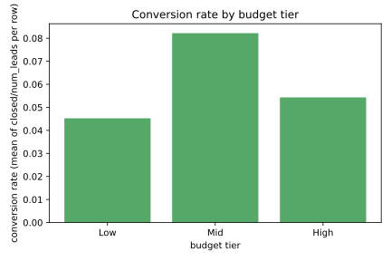
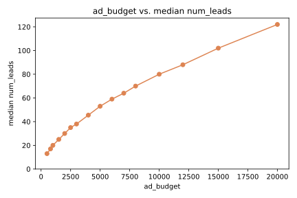
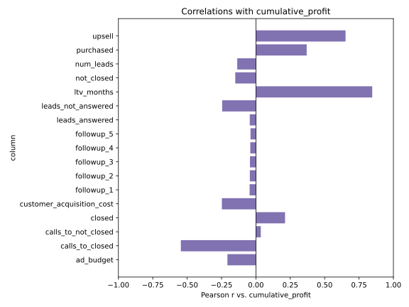
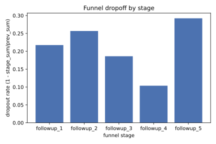
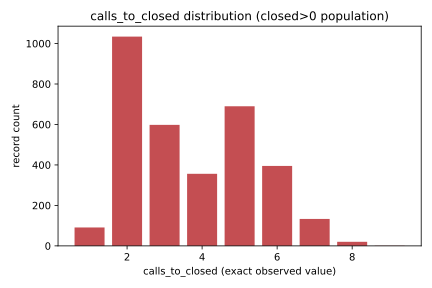

# FINDINGS.md — ניקוי + EDA (פאזה 5)

מסמך זה מרונדר אוטומטית מתוך `results` (ר' `docs/findings.json`) ע"י
`scripts/analysis.py`'s `render_findings_md` -- כל ערך אנליטי כאן הוא
`$placeholder` שנפתר מפלט פונקציית חישוב טהורה ובדוקה (PHASE5.md D6).
מקור הנתונים: `funnel_marketing_data.csv`, `source_sha256=8ac67d50a6f96a8ece8abd770a5a1901b34036a5c98656455eb04cee07d707aa`.

⚠ **כל הממצאים במסמך זה הם `dataset description` בלבד** (SPEC.md §
גרעיניות מעורבת's "מוסק בלבד" framing, PHASE5.md D3): שום ממצא כאן אינו
טענה סיבתית, ואף אחד מהם אינו משמש לבחירת פיצ'רים, ספים או מודל בפאזה 6.

## סקירת הקובץ (אוכלוסייה: 3,500, dataset description)

- שורות בקובץ: **3,500**.
- חסרים: `ltv_months` -- 4, `cumulative_profit` -- 29,
  לפחות אחד מהשניים -- 33.
- כפילויות: 19 שורות ב-9 קבוצות (זהות בכל 19 העמודות הגולמיות).

## חבילה 1 — טייר תקציב, כפילויות, קורלציות (אוכלוסייה: 3,500, dataset description)

שיעור ההמרה הממוצע לפי טייר תקציב (ממוצע `closed/num_leads` לשורה):

| טייר | n | שיעור המרה |
|---|---|---|
| Low | 780 | 4.5% |
| Mid | 1,717 | 8.2% |
| High | 1,003 | 5.4% |
| gap (1501-1999) | 0 | לא מוגדר -- אין ערך `conversion_rate` |

תרשים עמודות: שיעור ההמרה הממוצע (closed/num_leads לשורה) בכל אחד משלושת טייירי התקציב Low/Mid/High. הטייר 'gap' (טווח ad_budget 1501-1999, 0 רשומות בקובץ) אינו כלול בתרשים -- אין לו conversion_rate מוגדר ב-results, רק ספירת רשומות. טייר עם conversion_rate=None (למשל אפס רשומות באוכלוסייה) מסומן N/A במפורש ולא מצויר כעמודת אפס. כל הערכים לקוחים ישירות מ-results['budget_tiers'], בלי חישוב חוזר מה-CSV.

עקומת `ad_budget` → חציון `num_leads`, על 16 ערכי `ad_budget`
בדידים:

תרשים קו: החציון של num_leads עבור כל אחד מ-16 ערכי ad_budget הבדידים בקובץ, מסודר בסדר עולה לפי ad_budget. כל נקודה לקוחה ישירות מ-results['ad_budget_leads_curve'], בלי חישוב חוזר מה-CSV. תיאור דטהסט בלבד -- אין כאן מסקנה על יעילות תקציב.

קורלציית פירסון (r) מול `cumulative_profit`, לכל 17 העמודות
המספריות הגולמיות האחרות (למשל `ltv_months`: 0.85, `upsell`: 0.65):

תרשים עמודות אופקי: מקדם המתאם של פירסון (r) בין כל אחת מ-17 העמודות המספריות הגולמיות (למעט cumulative_profit עצמו) לבין cumulative_profit, ממוין בסדר אלפביתי לפי שם עמודה. עמודה עם שונות אפס או פחות משני זוגות תקפים (None ב-results, לא NaN) מסומנת N/A במפורש ואינה מצוירת -- אינה שקולה ל-r=0, שהוא ערך אמיתי (העדר קשר קווי נמדד). כל הערכים לקוחים ישירות מ-results['correlations'], בלי חישוב חוזר מה-CSV. תיאור דטהסט בלבד -- לא בסיס לבחירת פיצ'רים (D3).

## חבילה 1 — תשובות לשלוש שאלות הבריף (אוכלוסייה: 3,500, dataset description)

### כמה שורות לא שלמות, ואיך טיפלנו בהן?

**כמה.** 33 מתוך 3,500 השורות אינן שלמות: ב-4 חסר
`ltv_months`, וב-29 חסר `cumulative_profit`.

**מה נשמר במקור.** אף שורה לא נמחקה. `scripts/load_data.py` ממיר חסר ל-NULL
ואינו מסיר שורות, וכל ממצא במסמך זה מציין את האוכלוסייה שעליה חושב.

**מה קורה באימון.** בכל משימת מידול מוסרות רק שורות שהיעד שלהן חסר, ולכל
משימה בנפרד. המשימות P2, P3, P4 ו-P4S מתאמנות על רוכשים בלבד (`purchased=1`),
ו-P6 על כל הקובץ. הטבלה נמדדת מהנתונים בעזרת כלל האוכלוסייה של
`scripts/train.py`, ולא מצוטטת מהתכנון:

| משימה | יעד | חסרים ביעד בקובץ | שורות שהוסרו בגלל חסר ביעד | אוכלוסייה | חסרים בפיצ'רים |
|---|---|---|---|---|---|
| P2 | `ltv_months` | 4 | 0 | 3,163 | 0 |
| P3 | `upsell` | 0 | 0 | 3,163 | 0 |
| P4 | `referred` | 0 | 0 | 3,163 | 0 |
| P4S | תווית סופר-לקוח (נגזרת) | 0 | 0 | 3,163 | 0 |
| P6 | `cumulative_profit` | 29 | 29 | 3,471 | 0 |

- **P2:** `ltv_months` חסר ב-4 שורות; מתוכן 4 נמצאות מחוץ
  לאוכלוסיית P2 (שורות עם `purchased=0`), ו-0 הוסרו.
- **P4S:** התווית נבנית מהשוואות (`referred`, `upsell`, `ltv_months`), ולכן היא
  אינה חסרה לעולם, והאפס בשורת P4S נובע מההגדרה ולא ממדידה. שורה שחסר בה אחד
  משדות התווית מסווגת בשקט כ"לא סופר-לקוח"; באוכלוסיית P4S יש
  0 שורות כאלה.
- **P6:** `cumulative_profit` חסר ב-29 שורות, ו-29 מהן הוסרו;
  3,471 שורות נשארות באוכלוסיית P6.
- **פיצ'רים:** סך החסרים בפיצ'רים בכל אוכלוסיות האימון הוא
  0. לפיכך אין imputation בצינורות האימון: `PHASE6.md`
  סגר את הסעיף כ"לא נדרש, נמדד".

### האם יותר תקציב קונה באופן פרופורציונלי יותר לידים?

**התשובה: לא באופן פרופורציונלי. ככל שהתקציב גדל, מספר הלידים לכל ₪1,000 יורד.** זהו תיאור של הקובץ, ולא טענה על רווח או על סיבתיות.

אילו התקציב קנה לידים באופן פרופורציונלי, מספר הלידים לכל ₪1,000 היה קבוע בכל הרמות. בפועל הוא יורד מ-26.0 ברמה של ₪500 ל-6.1 ברמה של ₪20,000: תקציב גדול פי 40 מניב חציון לידים גדול פי 9.4 בלבד. הירידה עקבית: בכל אחת מ-16 רמות התקציב, מספר הלידים לכל ₪1,000 נמוך מזה שברמה שלפניה.

| `ad_budget` | n | חציון `num_leads` | חציון לידים לכל ₪1,000 |
|---|---|---|---|
| ₪500 | 109 | 13.0 | 26.00 |
| ₪800 | 154 | 17.0 | 21.25 |
| ₪1,000 | 219 | 20.0 | 20.00 |
| ₪1,500 | 298 | 25.0 | 16.67 |
| ₪2,000 | 410 | 30.0 | 15.00 |
| ₪2,500 | 346 | 35.0 | 14.00 |
| ₪3,000 | 331 | 38.0 | 12.67 |
| ₪4,000 | 316 | 45.5 | 11.38 |
| ₪5,000 | 314 | 53.0 | 10.60 |
| ₪6,000 | 199 | 59.0 | 9.83 |
| ₪7,000 | 185 | 64.0 | 9.14 |
| ₪8,000 | 124 | 70.0 | 8.75 |
| ₪10,000 | 195 | 80.0 | 8.00 |
| ₪12,000 | 116 | 88.0 | 7.33 |
| ₪15,000 | 113 | 102.0 | 6.80 |
| ₪20,000 | 71 | 122.0 | 6.10 |

⚠ הטבלה אינה אומרת אם תקציב גדול משתלם כלכלית. זו שאלת הרווח, והיא נענית
בחבילה 6. היא גם אינה מסבירה *מדוע* הלידים גדלים לאט מהתקציב.

### איזה טייר תקציב מתמיר הכי טוב, והאם זה מפתיע?

**התשובה: Mid**, עם שיעור המרה של 8.2%, לפני
High (5.4%) ו-Low (4.5%).
ההפרש בין הראשון לשני הוא 2.8 נקודות אחוז.

**האם זה מפתיע?** כן, זה מפתיע ביחס לציפייה הפשוטה שתקציב גדול יותר ימיר טוב יותר: שיעור ההמרה אינו עולה עם הטייר, מ-Low ל-Mid ול-High.

⚠ תיאור בלבד. הקובץ אינו מראה אם ההפרש נובע מגודל התקציב עצמו או מהרכב
הקמפיינים בכל טייר, ולכן אין כאן הסבר סיבתי.

## חבילה 5 — נשירה במשפך, calls_to_closed (אוכלוסייה: 3,500 / 3,318, dataset description)

נשירה בכל שלב במשפך (Σ/Σ, לא ממוצע יחסים לשורה), על 3,500 הרשומות:

תרשים עמודות: שיעור הנשירה בכל שלב במשפך השיווקי, מ-leads_answered ועד followup_5. כל עמודה מחושבת כ-1 פחות סכום השלב חלקי סכום השלב הקודם (Σ/Σ), לא כממוצע יחסים לשורה. שלב ללא ערך מוגדר (למשל כשסכום השלב הקודם הוא אפס) מסומן N/A במפורש ולא מצויר כעמודת אפס. כל הערכים לקוחים ישירות מ-results['funnel_dropoff'], בלי חישוב חוזר מה-CSV. סטטוס: תיאור דטהסט (dataset description) בלבד, לפי D3 -- לא נמצא בו קשר סיבתי.

שלב 1: 21.7% · שלב 2: 25.7% · שלב 3: 18.6% ·
שלב 4: 10.4% · שלב 5: 29.2%.

התפלגות `calls_to_closed` בתוך אוכלוסיית `closed>0` (3,318 רשומות):

תרשים עמודות: התפלגות calls_to_closed בפועל בתוך אוכלוסיית closed>0 -- לכל ערך calls_to_closed שנצפה בקובץ (ציר x), ספירת הרשומות עם אותו ערך בדיוק (ציר y), בלי חלוקה ל-bins מומצאים. סך התדירויות שווה population_n=3318. calls_to_closed מתועד ב-SPEC.md כממוצע ברמת רשומה, לא כהיסטוריית שיחות לעסקה בודדת. כל הערכים לקוחים ישירות מ-results['calls_to_closed']['frequency_by_calls_to_closed'], בלי חישוב חוזר מה-CSV.

מתוך 3,318 רשומות `closed>0`, החציון הוא 3, השכיח הוא
2 והממוצע 3.706. ב-1,595 מהן (48.07%) `calls_to_closed`
הממוצע הוא 4 ומעלה. בתת-האוכלוסייה `closed=1` (510 רשומות),
458 מהן (89.80%) מציגות `calls_to_closed >= 4`.

## M1 — ספירת אפסים ב-cumulative_profit (אוכלוסייה: 3,500, dataset description)

335 שורות עם `cumulative_profit == 0`, בנפרד מ-29
השורות החסרות ומ-0 שורות שליליות. הקובץ מייצג אפס במפורש
כ-0, ולכן הוא נספר בנפרד מ-`NaN` -- משמעותו העסקית אינה מוכרעת ללא מילון
נתונים.

## M2 — עקביות האפסים, לא לגיטימיות (אוכלוסייה: 3,500, dataset description)

⚠ אין כאן טענת לגיטימיות: אין מילון נתונים שמוכיח אם `0` הוא רווח אפס אמיתי
או קידוד למשהו חסר (SPEC.md § גרעיניות מעורבת). ראיות עקביות בלבד:

שיעור האפסים בכל חתך (P(profit=0|slice), המכנה גלוי):

| חתך | שיעור אפסים |
|---|---|
| purchased=0 | 99.4% |
| purchased=1 | 0.0% |
| closed=0 | 99.5% |
| closed>0 | 4.6% |

ממוצע `ltv_months`: קבוצת אפס 13.2, קבוצת ידוע-לא-אפס
22.9. ממוצע CAC: קבוצת אפס 729, קבוצת
ידוע-לא-אפס 1,438.

## M3 — עשירון עליון (אוכלוסייה: 3,471, dataset description)

אוכלוסייה: 3,471 הרשומות שבהן `cumulative_profit` ידוע
(29 המוחרגות מדווחות לצידו, לא מוטמעות ולא מסוננות). `K=348`
(10.0%), ערך גבול 27,018, עם 2
רשומות עליו בדיוק. חלק העשירון מסך הרווח: 24.2%
(exact-K, 348 רשומות) לעומת 24.3% (inclusive-ties,
349 רשומות).

## M4 — רווח לפי טייר (אוכלוסייה: 3,500, dataset description)

| טייר | n | חסרים | סכום | ממוצע |
|---|---|---|---|---|
| Low | 780 | 5 | 1,775,180 | 2,291 |
| Mid | 1,717 | 15 | 37,089,864 | 21,792 |
| High | 1,003 | 9 | 5,154,619 | 5,186 |
| gap | 0 | 0 | לא זמין | לא זמין |

## M5 — ספירת outliers (אוכלוסייה: 3,500, dataset description)

שתי שיטות בנפרד, לעולם לא מאוחדות: `1.5×IQR` -- 321 רשומות
ייחודיות מסומנות; `p1/p99` -- 218 רשומות ייחודיות מסומנות.
חפיפה בין שתי השיטות: 89 רשומות. סימון תיאורי בלבד -- אינו
גורר מחיקה או Winsorization; הספים אינם עוברים לפאזה 6.

## M6 — פרופיל הכפילויות (אוכלוסייה: 3,500, dataset description)

זהה במדויק לנתוני חבילה 1 לעיל (19 שורות ב-9 קבוצות)
-- `m6_duplicate_profile()` הוא alias ל-`duplicates()`, לא הגדרה מתחרה.

## מסקנת P5 — תיאורית, לא סיבתית (אוכלוסייה: 3,500 / 3,318, dataset description)

הניסוח הבא זהה מילולית לניסוח הנעול ב-SPEC.md § מסקנת P5:

> **לא. אין לאמץ עצירה אוטומטית אחרי המעקב השלישי.** שיעור הנשירה לאחר המעקב
> הרביעי הוא הנמוך בשרשרת (10.4%). מבין 3,318 הרשומות שבהן נסגרה עסקה
> (`closed>0`), הקובץ אינו מאפשר למנות סבבי מעקב לעסקה בודדת. במדד הקרוב,
> התפלגות `calls_to_closed` ברמת הרשומה, החציון הוא 3, הערך
> השכיח הוא 2 והממוצע 3.706; ב־1,595 רשומות (48.07%) הממוצע הוא 4 שיחות ומעלה.
> חמשת שלבי המעקב מתארים כמה לידים נותרו אחרי כל סבב, ואילו
> `calls_to_closed` הוא ממוצע שיחות ברמת רשומה שיכול להגיע עד 9. לכן אי אפשר
> לומר ש־48.07% מהעסקאות הבודדות דרשו 4+ שיחות, או שהשיחות המאוחרות גרמו
> לסגירה. ההמלצה היא להמשיך מעקבים אחרי השלישי באופן מבוקר ולמדוד בכל שלב
> את שיעור הסגירה השולי, זמן העבודה והעלות לפני שינוי קבוע במדיניות.

## מקור הנתונים

`funnel_marketing_data.csv`, `source_sha256=8ac67d50a6f96a8ece8abd770a5a1901b34036a5c98656455eb04cee07d707aa`. אין נגיעה
ב-Supabase (D10). ראה `docs/findings.json` לפלט המלא, ו-checkpoints
7-11 ב-`ROADMAP.html` לראיות המימוש והבדיקות.
